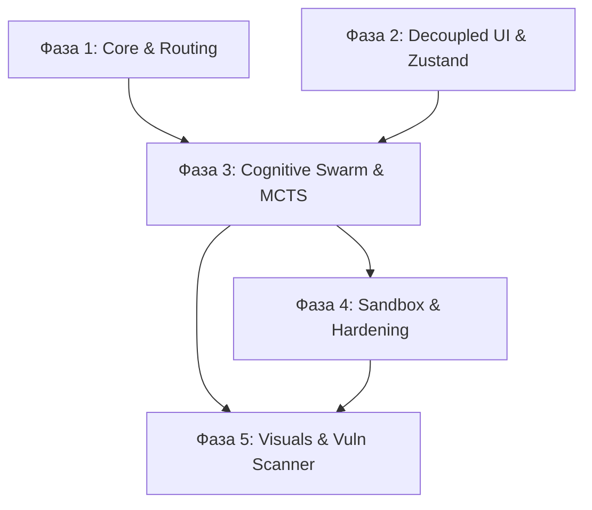

# 🗺️ Эволюционная карта проекта Archimedes: Фазы Разработки

Этот документ предоставляет детальную разметку папок и файлов проекта **Archimedes (Cosmo)** по 5 ключевым фазам развития и функционала. Это помогает разработчикам и ИИ-агентам мгновенно ориентироваться в архитектурных пластах системы.

---

## 🧭 5 Ключевых Фаз Системы

---

## 📁 Подробная разметка по фазам

### 🔌 Фаза 1: Core Engine & Unified Routing (Ядро и Маршрутизация)
*Базовый каркас системы: сервер FastAPI, управление конфигурациями, WebSocket-подключения, системная телеметрия и Prometheus-метрики.*
* **`backend/main.py`** — Главная точка входа API сервера.
* **`backend/config.py`** — Менеджер настроек `Settings` и изоляции среды.
* **`backend/telemetry.py`** — Инициализация трассировки и логирования.
* **`backend/metrics.py`** — Prometheus-метрики для мониторинга активности.
* **`backend/run.py`** — Стартовый скрипт проверки портов.
* **`backend/websocket/`** — WebSocket-обработчики сессионного стриминга.
* **`backend/middleware/`** — Промежуточное ПО безопасности и ограничения лимитов запросов.
* **`backend/db/`** — Слой баз данных: ORM-модели (Pydantic v2) и SQLite CRUD.
* **`backend/models/`** — Адаптеры языковых моделей (Gemini, Groq, Ollama, Anthropic).

### 🎨 Фаза 2: Decoupled UI & Zustand State (Фронтенд и Глобальный Стейт)
*Пользовательский интерфейс: Next.js-фронтенд (App Router), реактивное состояние Zustand, кастомные React-хуки бизнес-логики и Framer Motion анимации.*
* **`frontend/app/`** — Маршруты страниц (Chat, Settings, Canvas).
* **`frontend/components/`** — Модульные React-компоненты (Settings, Chat, Appshots).
* **`frontend/hooks/`** — Кастомные хуки взаимодействия с API и WebSocket (`useSettings`, `useAppshots`).
* **`frontend/lib/`** — Zustand-хранилища глобального состояния приложения (`store.ts`).
* **`frontend/public/`** — Публичные статические ассеты и иконки.

### 🧠 Фаза 3: Cognitive Swarm & MCTS Reasoning (Когнитивный Сварм и Мышление)
*Мозг агента: планирование задач, Mixture of Agents (MoA) синтез, Monte Carlo Tree Search (MCTS), динамические библиотеки навыков и сессионная память.*
* **`backend/agent/core.py`** — Главный когнитивный движок `ArchimedesCosmoAgent`.
* **`backend/agent/orchestration/`** — Сварм-архитектура: `HydraSwarm` (Commander, Scout, Warrior, Sentinel), `MCTS` дерево и планировщики.
* **`backend/agent/intelligence/`** — Движки Mixture of Agents (MoA), Chain of Thought (CoT) и рефлексии.
* **`backend/agent/skills/`** — Динамический `SkillEngine` на базе векторной БД Chroma.
* **`backend/memory/`** — Трехуровневая сессионная память, авто-сжатие контекста (`AutoCompact`) и графы знаний.

### 🛡️ Фаза 4: Restricted Execution & Sandbox Hardening (Песочница и Безопасность)
*Среда выполнения и защита: изолированные Docker-контейнеры, AST-анализ кода Python, quote-aware экранирование шелла Bash, отзыв JWT-токенов.*
* **`backend/sandbox/`** — Persistent Shell, контейнеры Kubernetes и Docker, изоляция файловой системы `SandboxFilesystem`.
* **`backend/security/sandbox_hardening.py`** — Статический анализатор кода Python на вредоносные вызовы.
* **`backend/tools/bash_security.py`** — Умная многоуровневая валидация команд Bash против инъекций.
* **`backend/auth/`** — JWT Refresh-токены, отзыв JTI и хэширование ключей в БД.

### 📊 Фаза 5: Presentation Engine & Visual Analysis (Презентации и Сканирование)
*Продвинутый визуальный вывод и аудит: генерация презентаций Marp / Canvas, Playwright-скриншоты для Visual QA, Bumblebee-сканер уязвимостей.*
* **`backend/api/marp_routes.py`** — API эндпоинты генерации слайдов в формате Marp Markdown.
* **`backend/agent/tools/canvas_tool.py`** — Canvas Engine для интерактивных презентаций React.
* **`backend/agent/vision_feedback.py`** — Анализ интерфейса `Visual QA` с использованием Playwright и Gemini Vision.
* **`backend/security/vuln_scanner.py`** — Сканер уязвимостей зависимостей, конфигураций MCP и файлов среды.
* **`frontend/components/AppshotOverlay.tsx`** — Региональный скриншотер интерфейса и аннотации.

---

## 📋 Сводная таблица распределения
| Путь к файлу / папке | Фаза | Зона ответственности |
| :--- | :---: | :--- |
| `backend/main.py` | **1** | Запуск API и инициализация фоновых задач |
| `backend/config.py` | **1** | Конфигурация среды и переменных |
| `backend/websocket/` | **1** | WebSocket-сессии с пользователем |
| `backend/middleware/` | **1** | Заголовки безопасности и лимитер запросов |
| `frontend/lib/store.ts` | **2** | Zustand глобальный стейт |
| `frontend/hooks/` | **2** | React хуки бизнес-логики |
| `backend/agent/core.py` | **3** | Архимед когнитивный цикл |
| `backend/agent/orchestration/` | **3** | MCTS-поиск и Hydra Swarms |
| `backend/memory/auto_compact.py` | **3** | Алгоритм умного сжатия контекста |
| `backend/sandbox/` | **4** | Docker/K8s изолированная песочница |
| `backend/tools/bash_security.py` | **4** | Quote-aware парсер команд шелла |
| `backend/security/vuln_scanner.py` | **5** | Bumblebee Vulnerability Scanner |
| `backend/api/marp_routes.py` | **5** | Marp презентационный эндпоинт |
| `frontend/components/AppshotOverlay.tsx` | **5** | Элементы захвата экрана и аннотаций |
